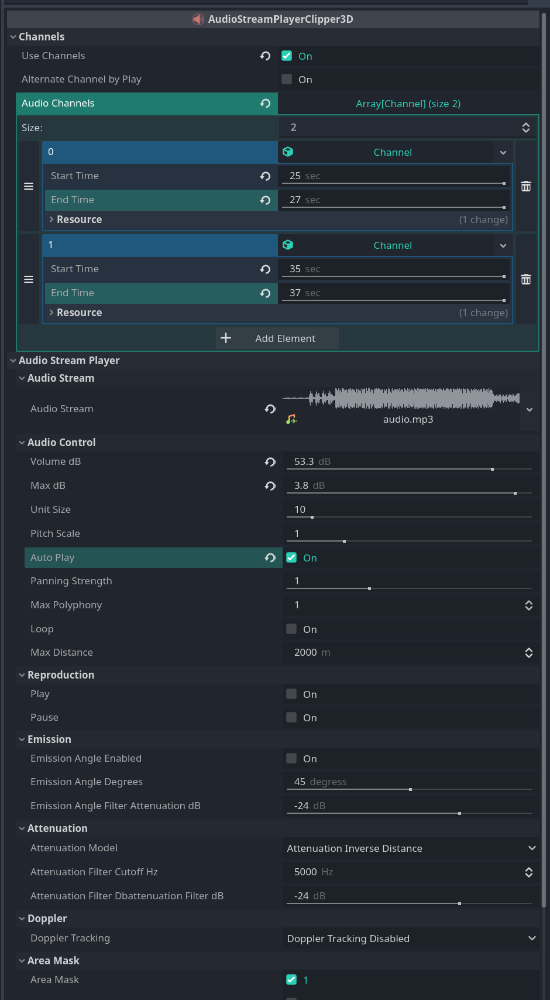

# AudioStreamPlayerClipper3D: Advanced Audio Control for Godot (3D)

Enhance your audio capabilities in Godot with **AudioStreamPlayerClipper3D**. This plugin provides powerful audio clipping control, allowing you to precisely set the start and end points of your audio clips directly in 3D space, offering flexibility beyond Godot's native options.

**Why use this plugin?**  
With **AudioStreamPlayerClipper3D**, you have full control over audio playback, with the ability to clip audio in real time and adjust it for various audio events in your game. This is especially useful for dynamic and repetitive sounds, like character footsteps, where you can alternate between different footsteps sounds and program the clip playback in a more natural and realistic way.

**Key Features**

- **Precise Audio Clipping** – Set the exact start and end points of your audio clips.
- **Footstep Sound Variation** – Create dynamic footstep sounds by alternating between different audio clips for each movement of your character.
- **Full Platform Support**, including **web**, ensuring that your cuts and audio settings are preserved accurately across all platforms.
- **Quick Testing in the Editor** – Test the audio directly in the inspector without needing to run the game, making it easier to refine your sounds.
- **Custom Playback Order** – You can program the playback to play one audio channel at a time or play the clipped sounds in any order you prefer.

## Default Settings:

- **use_channels = false**
- **alternate_channel_by_play = false**
- **audio_channels = null**
- **audio_stream = null**
- **volume_db = 0.0**
- **max_db = 3.0**
- **unit_size = 10.0**
- **pitch_scale = 1.0**
- **panning_strength = 1.0**
- **max_polyphony = 1**
- **loop = false**
- **max_distance = 2000**
- **emission_angle_enabled = false**
- **emission_angle_degrees = 45.0**
- **emission_angle_filter_attenuation_db = -24.0**
- **attenuation_model = AudioStreamPlayer3D.ATTENUATION_INVERSE_DISTANCE**
- **attenuation_filter_cutoff_hz = 5000**
- **attenuation_filter_dbattenuation_filter_db = -24.0**
- **doppler_tracking = AudioStreamPlayer3D.DOPPLER_TRACKING_DISABLED**
- **area_mask = 1**
- **pause = false**
- **auto_play = false**
- **play = false**

```js
    // Exemple:

	var audio_clipper3D: AudioStreamPlayerClipper3D = AudioStreamPlayerClipper3D.new()
	audio_clipper3D.use_channels = true
	audio_clipper3D.alternate_channel_by_play = false

	var chanel1: Channel = Channel.new()
	chanel1.start_time = 25.0
	chanel1.end_time = 30.0
	audio_clipper3D.audio_channels = [chanel1]

	var audio_stream: AudioStreamMP3 = load("res://assets/audios/audio.mp3")
	audio_clipper3D.audio_stream = audio_stream

	audio_clipper3D.volume_db = 10.0
	audio_clipper3D.max_db = 3.0
	audio_clipper3D.unit_size = 10.0
	audio_clipper3D.pitch_scale = 1.0
	audio_clipper3D.panning_strength = 1.0
	audio_clipper3D.max_polyphony = 1
	audio_clipper3D.loop = true
	audio_clipper3D.max_distance = 2000

	audio_clipper3D.emission_angle_enabled = true
	audio_clipper3D.emission_angle_degrees = 45.0
	audio_clipper3D.emission_angle_filter_attenuation_db = -24.0
	audio_clipper3D.attenuation_model = AudioStreamPlayer3D.ATTENUATION_INVERSE_DISTANCE

	audio_clipper3D.attenuation_filter_cutoff_hz = 5000
	audio_clipper3D.attenuation_filter_dbattenuation_filter_db = -24.0

	audio_clipper3D.doppler_tracking = AudioStreamPlayer3D.DOPPLER_TRACKING_DISABLED
	audio_clipper3D.area_mask = 1

	audio_clipper3D.pause = false
	audio_clipper3D.auto_play = false

	add_child(audio_clipper3D)

	audio_clipper3D.play = true
```

## 

[Watch the video here](https://www.youtube.com/watch?v=iW02oT6BncY)

## Installation

1. Download the plugin and place the `AudioStreamPlayerClipper3D` folder inside the `addons` folder of your Godot project.
2. Enable the plugin in **Project Settings** > **Plugins**.

## Usage

1. Select the AudioStreamPlayerClipper3D node in your scene.
2. In the Inspector, find the **AudioStreamPlayerClipper3D** section.
3. Customize the settings, including start and end time, loop, autoplay, and more.
4. Test your audio directly in the inspector for quick, precise adjustments.

## Support

For questions or additional support, feel free to contact [saulocoexi@gmail.com](mailto:saulocoexi@gmail.com).

---

Enjoy complete and efficient control over your 3D audio with **AudioStreamPlayerClipper3D** for Godot!
